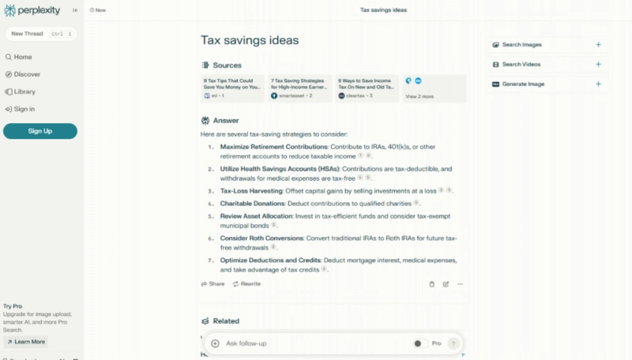
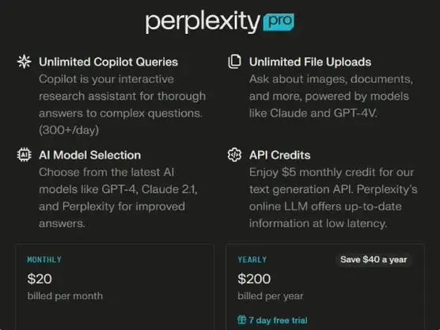

# Perplexity：聊天式AI搜索引擎，让找答案像聊天一样简单

---

你是不是也有过这种经历：在传统搜索引擎里输入一个问题，结果跳出来一堆广告和不相关的链接，翻了好几页才找到想要的答案？或者明明只是想知道一个简单的事实，却要自己从十几个网页里拼凑信息？

Perplexity 就是为了解决这些烦恼而生的。它把 AI 聊天机器人和搜索引擎结合在一起，你直接用自然语言提问，它就能快速定位相关信息，然后用简洁明了的方式告诉你答案。不管是复杂的科学问题还是日常小疑问，Perplexity 都能帮你搞定。

**Perplexity官网入口：** https://www.perplexity.ai/

---

## 它是怎么做到的？

### 大规模语言模型在背后撑腰

Perplexity 的核心是大规模语言模型。这玩意儿通过学习海量文本数据，掌握了丰富的语义知识和语言表达能力。当你输入问题时，它能理解你的意思，然后从互联网上提取最相关的信息。

### 知识图谱让它更聪明

除了关键词匹配，Perplexity 还用了知识图谱技术，建立了庞大的语义索引。这意味着它不仅能看懂你的问题，还能理解问题背后的逻辑关系和语境。比如你问"苹果的营养价值"，它知道你说的是水果，而不是那家科技公司。

### 越用越懂你

通过用户的互动反馈，Perplexity 会不断调整和优化回答策略。用的人越多，它就越能准确理解用户的意图，提供更贴合需求的答案。

---

## 为什么值得一试？

### 像和朋友聊天一样自然

Perplexity 采用聊天对话式的交互方式，让你感觉像是在和一个聪明的朋友交流。这种方式降低了信息查询的门槛，整个过程也更人性化。

### 答案都有出处，不怕被忽悠

Perplexity 提供的答案都附带详细的来源标注，你可以追溯信息的出处。这对学术研究、新闻报道等领域特别重要——毕竟，知道信息从哪来，才能判断它靠不靠谱。

### 适用范围广得惊人

学生写论文、科研人员查资料、普通人想了解某个概念，Perplexity 都能提供所需信息。这种广泛的适用性让它成为一个强大的工具箱。

### 什么问题都能问

科技前沿、文学艺术、日常生活常识，Perplexity 都能迅速找到答案。它还具备一定的逻辑推理能力，可以在一定程度上应对复杂问题。

### 界面简洁，没有广告骚扰

与传统搜索引擎不同，Perplexity 的界面非常简洁，没有烦人的广告干扰。你能专注于获取信息本身，而不是被各种推广内容分散注意力。

### 直接给答案，不用自己翻页

针对大部分问题，Perplexity 都能直接给出准确答案，而不是像传统搜索引擎那样列出一堆网页链接让你自行筛选。这省下的时间，够你多喝两杯咖啡了。

👉 [想体验更高效的AI搜索方式？点击了解Perplexity如何改变你的信息获取习惯](https://pplx.ai/ixkwood69619635)

---

## 你可能想问的问题

**Q: Perplexity 是如何工作的？**

A: 当你提交一个问题后，Perplexity 会通过先进的自然语言处理技术理解问题的意思，并在网络上搜索相关信息。最终，它会根据所找到的内容合成出答案，并清晰地显示给你。

**Q：Perplexity官网为什么打不开？**

A：Perplexity 目前屏蔽了部分地区的访问，包括国内用户。因此，国内用户暂无法使用。可以选择国内其他类似的 AI 搜索引擎，如：心流、XAnswer、360AI搜索、HotBot 等。

**Q: 使用 Perplexity 是否免费？**

A: Perplexity 提供了免费的基础版本，你可以直接开始使用而无需支付任何费用。对于需要更多高级功能的用户，Perplexity 还提供了付费的专业版订阅。

**Q: Perplexity 如何保证信息的真实性？**

A: Perplexity 在展示答案的同时，会标明信息来源，你可以直接访问原始网站核实信息的真伪。此外，系统还会优先考虑权威和可信度高的网站作为信息来源。

**Q: 我可以在哪些方面使用 Perplexity？**

A: Perplexity 非常适合用于快速查找事实类信息、学术研究辅助、写作灵感启发等多种场合。几乎任何需要信息的地方，都可以尝试使用 Perplexity。

**Q: 如何启动 Perplexity 的 ProSearch 功能？**

A: ProSearch 是一项高级搜索功能，可以让你获得更深入的研究报告。每个账户每四小时可以获得五次免费使用的机会，如果需要更多使用频率，则需要订阅专业版服务。

**Q: Pro 订阅有哪些额外的功能？**

A: Pro 版本除了增加 ProSearch 的使用次数外，还提供了一系列其他高级功能，比如更多的自定义选项、更快速的支持响应等。

---

## 写在最后

Perplexity AI 代表了未来搜索引擎的一种趋势——更加注重用户体验和信息质量。通过结合最新的 AI 技术和人性化的交互设计，Perplexity 成功地让信息搜索变得更简单、更直接。

在这个信息爆炸的时代，我们需要的不是更多的信息，而是更准确、更高效的信息获取方式。👉 [Perplexity 正是为此而生，它让找答案像聊天一样简单](https://pplx.ai/ixkwood69619635)。随着技术的进步和应用场景的拓展，Perplexity 必将在搜索领域扮演更重要的角色，成为人们日常生活中不可或缺的一部分。
